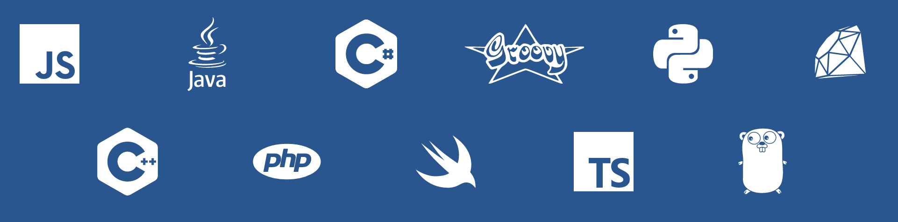

**What**: [Better Code Hub](https://bettercodehub.com) - a [GitHub Integration](https://github.com/integrations/better-code-hub) provided by [Software Improvement Group SIG](https://www.sig.eu).

**When**: 21 & 22 April 2017 during the [Blockgeeks Lab Hackathon](http://bglhackathon.com).

**Where**: [MaRS Discovery District, Toronto Canada](https://marsdd.com).

With Better Code Hub, you can check how good is your team's code in raport with the state of the art in software engineering. If Better Code Hub says you're compliant (✅) then it means you're performing like the top teams in the industry with regards to 10 guidelines for Maintainable Software. 

The guidelines are described in full in the book [“Building Maintainable Software”](http://shop.oreilly.com/product/0636920049159.do) - be sure to get your copy during the event! 

Compliance to guidelines is derived from the Software Improvement Group's industry benchmark (8 billion lines of code in more than 180 different technologies). 

## Supported Languages

## If you're on GitHub you're good to go 

* **Public** repo? Just go to [bettercodehub.com](https://bettercodehub.com) and login [FREE] with your GitHub account.

* **Private**? Share your Github handle to get [PRO] access. Before the event: e-mail your name and personal GitHub handles to [bettercodehub@sig.eu](mailto:bettercodehub@sig.eu). During the event: go to the local Hackathon staff with the handles.

## Zero set-up time

Using Better Code Hub is easy. Just head over to [bettercodehub.com](https://bettercodehub.com) and login with your GitHub account. You'll then see your repos, and you can start an analysis clicking the ▶️ button. 

If you want Better Code Hub to run for every Push and Pull Request on your repo, click the ⚙ icon and toggle the switch:

## Excluding files from analysis

Better Code Hub analyses all the code that is in your repository. This might include all the external libraries that you use. 

First do an initial analysis of your repository, so the "Analysis configuration" option becomes available. Then you can exclude these files by creating a **.bettercodehub.yml** configuration file located in the root of your repository. The code that goes into this file, can be generated with the "Analysis configuration" page which contains the following widget:

You can find this page by first clicking on the ⚙ icon and then clicking on "Analysis configuration". 

The resulting configuration file might look like:

~~~~
exclude:
- /mylibrary/src/.*
component_depth: 1
languages:
- java
~~~~

Of course, you can create the configuration file directly, and place it to the root of your repository. For details check the [configuration manual](https://bettercodehub.com/docs/configuration-manual).

## Support and PRO License 

* If needed, get support through bettercodehub@sig.eu
* Your Pro access to Better Code Hub remains valid for *6 months* after the Hackathon

## We'd like to hear from you
Don't hesitate to send us feedback at [bettercodehub@sig.eu](mailto://bettercodehub@sig.eu]). 

**Let's build some great software** 😊

Go, go, go! 

[Rob](https://github.com/robvanderleek), [Mircea](https://github.com/mcadariu) and [Michiel](https://github.com/michielcuijpers)

