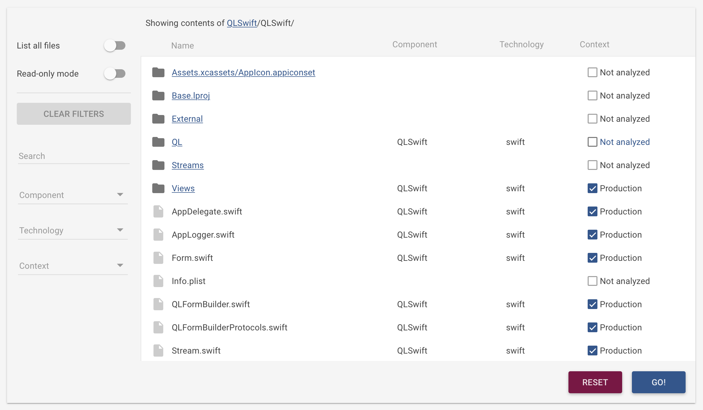

**What**: [Better Code Hub](https://bettercodehub.com) - a [GitHub Integration](https://github.com/integrations/better-code-hub) provided by [Software Improvement Group SIG](https://www.sig.eu).

**When**: 21 & 22 April 2017 during [Blockgeeks Lab Hackathon](http://bglhackathon.com)

**Where**: [MaRS Discovery District, Toronto Canada](https://marsdd.com)

## Why look at code quality?

Because our society needs solutions that are innovative and sustainable

* Why look at the quality of Blockchain implementations? [Here's our answer.](https://medium.com/@jstvssr/why-blockchain-needs-future-proof-code-cb09b39175e1#.bqfmcig55)

* Has this been done before in the context of Hackathons? Yes, [Here's a write-up.](https://medium.com/softwareimprovementgroup/how-a-hackathon-appreciates-quality-code-bd1bdb8b3479)

## How does it work?

Your code will be automatically evaluated for compliance with these 10 guidelines for building maintainable software:

* Write Short Units of Code
* Write Simple Units of Code
* Write Code Once
* Keep Unit Interfaces Small
* Separate Concerns in Modules
* Couple Architecture Components Loosely
* Keep Architecture Components Balanced
* Keep Your Codebase Small
* Automate Tests (You can ignore this guideline for now, since it is not in the scope of this course.)
* Write Clean Code

The guidelines are described in full in the book [“Building Maintainable Software”](http://shop.oreilly.com/product/0636920049159.do) (get your free copy during the event!)

* Using Better Code Hub is easy. Head over to [bettercodehub.com](https://bettercodehub.com) and login with your GitHub account. You'll then see your repos, and you can start an analysis clicking the ▶️ button. 

* If you want Better Code Hub to run for every Push and Pull Request on your repo, click the ⚙ icon and toggle the switch:

* 16 modern programming languages are [supported](https://bettercodehub.com/docs/configuration-manual). Max repo size is 100,000 lines of code. 

## Setup

Better Code Hub analyses all the code that is in your repository. This might include all the external libraries that you use (CocoaPods are excluded by default (go heuristics!)).

First do an initial analysis of your repository, so the "Analysis configuration" option becomes available. Then you can exclude these files by making a **.bettercodehub.yml** in the root of your repository. The code that goes into this file, can be generated under "Analysis configuration" under "Settings" in Better Code Hub:

This might look like:

`exclude:`

`- /mylibrary/src/.*`

`component_depth: 1`

`languages:`

`- java`

## Planning to use a private repository? 

1. Before the event: e-mail your team name and personal GitHub handles to [bettercodehub@sig.eu](mailto:bettercodehub@sig.eu) to get Pro access. 

2. During the event: go to the local hackathon staff and share your Github handle to get Pro access.

3. Go to [bettercodehub.com](https://bettercodehub.com) 

4. Improve code! 😊

5. If needed, get support through bettercodehub@sig.eu

6. Your Pro access to Better Code Hub remains valid for *6 months*

## Feedback 

Don't hesitate to send us feedback about our platform at bettercodehub@sig.eu. 

Let's build some great software!

[Rob](https://github.com/robvanderleek), [Mircea](https://github.com/mcadariu) and [Michiel](https://github.com/michielcuijpers)

